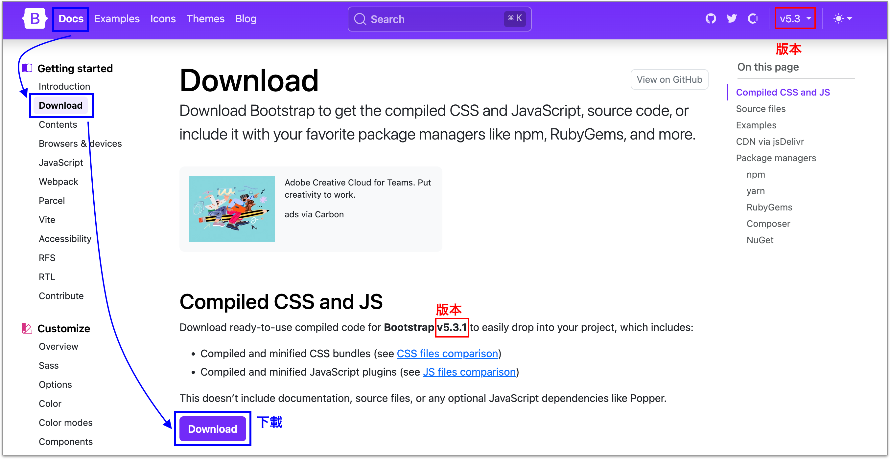
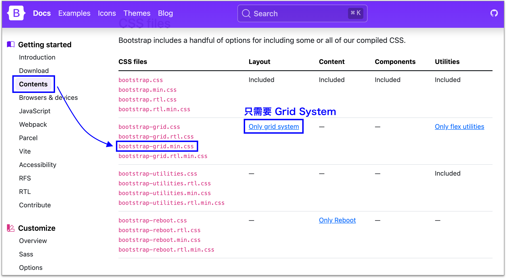

# 5.1 載入 Grid 相關 CSS

## 下載 Bootstrap Grid System

進到 [Bootstrap 官網](https://getbootstrap.com/)，然後如下示意圖來下載，也可順便留意所下載的本版：

<figure><figcaption></figcaption></figure>

然後在下圖的示意中，說明了若只需要「Grid System」的話，所需要的檔案：

<figure><figcaption></figcaption></figure>

從剛剛下載的資料夾裡，有 **`css`** 資料夾，在裡面找到 **`bootstrap-grid.min.css`** 檔案，如下圖：

<figure><figcaption></figcaption></figure>

請複製一份，放到 **`practice/vendors/bootstrap/`** 資料夾裡即可。

## 載入資源的檔案大小

### css 部份

全部 Bootstrap 相關的 css：

* bootstrap.min.css → **164kb**

將上述的 `bootstrap.min.css` 拆解出僅剩 `grid` 部份及 `reboot` 部份，按照官方說明，reboot 是從 [Normalize.css](https://necolas.github.io/normalize.css/) 拿過來用，目的在儘可能保持瀏覽器的一致性：

