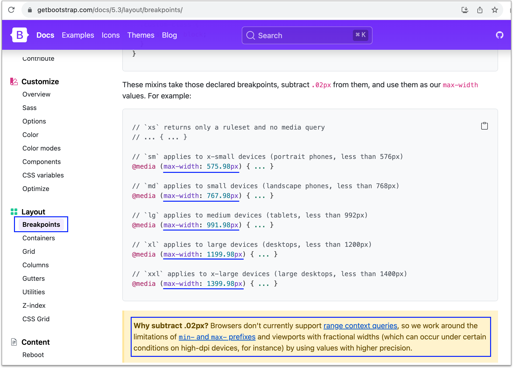

# 6.3 breakpoint 練習

## Media Query 遇到 max-width

遇到 max-width，需扣掉 0.02px，如下示意：

<figure><figcaption></figcaption></figure>


## breakpoint 練習

完成結果示意：



請建立 **`practice/rwd_sample.html`** 檔案，完成上述影片的示意，提供以下的 html：

```html
<div class="grid_container">
  <header class="grid_item">
    這是 header
  </header>
  <aside class="grid_item">
    這是 aside
  </aside>
  <main class="grid_item">
    這是 main
  </main>
  <section class="grid_item">
    這是 section
  </section>
  <footer class="grid_item">
    這是 footer
  </footer>
</div>

<div class="content_block">
  
</div>
```

以及 CSS：

```css
* {
  box-sizing: border-box;
}
body{
  margin: 0;
}

div.grid_container{
  border: 1px solid red;
  padding: 10px;
  display: grid;
  gap: 10px;
  grid-template-columns: 1fr 2fr 1fr;
  grid-template-areas: "header header section" "aside main section" "aside footer footer";

  width: 1320px;
  margin: 0 auto;
}

div.grid_container .grid_item{
  border: 1px solid blue;
}

/* 各自給定名稱 */
div.grid_container header.grid_item{
  grid-area: header;
}
div.grid_container aside.grid_item{
  grid-area: aside;
}
div.grid_container main.grid_item{
  grid-area: main;
}
div.grid_container section.grid_item{
  grid-area: section;
}
div.grid_container footer.grid_item{
  grid-area: footer;
}

/* 滿版圖片區塊 */
div.content_block{
  border: 1px solid blue;
  margin: 0 auto;
  width: 100%;
  font-size: 0;
  height: 200px;
  overflow: hidden;

  position: relative;
}
div.content_block img{
  position: absolute;
  top: 50%;
  left: 50%;
  transform: translate(-50%, -50%);

  min-width: 100%;
  min-height: 100%;
}
```


參考作法：



