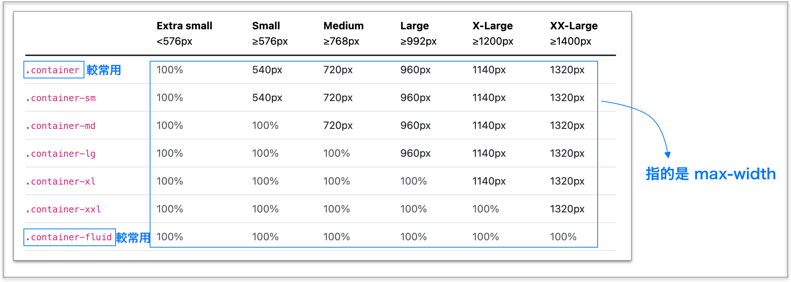

# 5.2 佈局 Layout

## 網格系統(v5)

[https://getbootstrap.com/docs/5.3/layout/grid/#grid-options](https://getbootstrap.com/docs/5.3/layout/grid/#grid-options)

記得以下這幾個版面的分界點：

* 576px
* 768px
* 992px
* 1200px
* 1400px

## container 與 container-fluid

如下示意圖：

<figure><figcaption></figcaption></figure>

## 列、欄與 container

* 將 **`列`** 寫在 container 中。
* 將 **`欄`** 寫在 列中。
* 每一列共有視覺上看不到的 12 欄可做劃分。

## 欄自動排版

### 範例 1：不論任何範圍，各欄寬度自動均分



### 範例 2：不論任何範圍，設定某欄佔幾欄



## 指定螢幕在特定範圍，設定各欄所佔的欄數

## 範例 1：指定 sm 範圍以上三欄均分


sm 範圍以上三欄均分


請試著改成 md 範圍、lg 範圍、xl 範圍、xxl 範圍，並觀察。

## 範例 2：欄的順序

在「欄」的地方，加上 `order-*`，指定順序，這是 flexbox 裡的 order 屬性。

也可以設定 `order-{breakpoint}-*`，指定順序。

例：



練習：設定螢幕寬度在**小於等於 575.98px** 時，出現的順序由上至下為「**第三欄、第二欄、第一欄**」：



## 範例 6：分界點練習 - 所有範圍


分界點練習，所有圍範


## 範例 7：分界點練習 - sm 範圍以上


分界點練習，sm 範圍以上


## 範例 8：分界點練習 - 同時設定所有範圍及 md 範圍以上


分界點練習，多個範圍一起使用&#x20;


## 範例 12：欄的位移

語法：offset-{breakpoint}-{number}



## 範例 13：巢狀式

在 column 裡面的部份，也可以再放 row 來切 12 欄。



## 範例 14：將 row 用在其它 div

關於左右 margin 負邊界(未指定寬度的情況下，左右的 margin 為負值時，會創造出額外空間)：



將 Bootstrap 的 row(有負邊界) 用在其它 div(需要加上左右 padding)：



(註：[var() 函式預設值的寫法](https://codepen.io/carlos411/pen/oNZzgZp))

結論：

* `.row` 可以運用在任何地方，不一定要放在 `.container` 或 `.container-fluid` 裡面。
* 如果是 v5 的版本，包住 div.row 的父層 div，設定 `padding-left: .75rem`、`padding-right: .75rem` 即可。

