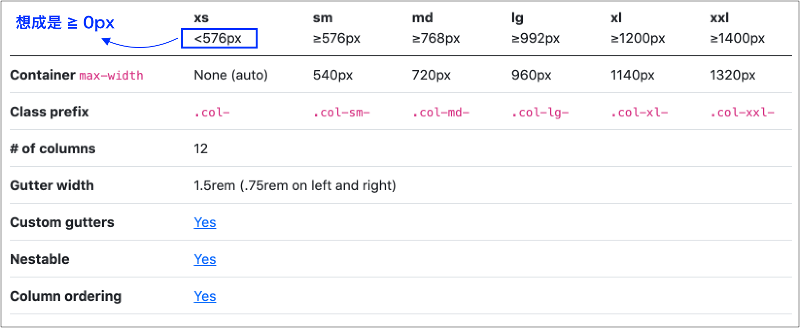

# 5.2 Grid System

## 網格(Grid)系統(v5 版本)

[https://getbootstrap.com/docs/5.3/layout/grid/#grid-options](https://getbootstrap.com/docs/5.3/layout/grid/#grid-options)

<figure><figcaption></figcaption></figure>

記得以下這幾個版面的分界點：

* **`xs`**：螢幕寬度大於等於 0px。
* **`sm`**：螢幕寬度大於等於 576px。
* **`md`**：螢幕寬度大於等於 768px。
* **`lg`**：螢幕寬度大於等於 992px。
* **`xl`**：螢幕寬度大於等於 1200px。
* **`xxl`**：螢幕寬度大於等於 1400px。


## container 與 container-fluid

如下示意圖：

<figure><figcaption></figcaption></figure>


## 列、欄與 container

* 將 **`列`** 寫在 container 中。
* 將 **`欄`** 寫在 列中。
* 每一列共有視覺上看不到的 12 欄可做劃分。


## 欄自動排版


### 範例 1：不論任何範圍，各欄寬度自動均分




### 範例 2：不論任何範圍，設定某欄佔幾欄




## 指定螢幕在特定範圍，設定各欄所佔的欄數


### 範例 1：指定 sm 範圍以上三欄均分




### 範例 2：指定 md 範圍以上，均分或設定所佔的欄數




### 範例 3：多個斷點一起使用




## 其它

### 範例 1：欄的位移

語法：**`offset-{breakpoint}-{number}`**

在某個 `{breakpoint}` 範圍以上，位移 `{number}` 欄。例：




### 範例 2：欄的順序

語法：**`order-{breakpoint}-{number}`**

在某個 `{breakpoint}` 範圍以下，`{number}` 數值較小的先出現。例：




### 範例 3：巢狀式

在 `column` 裡面的部份，也可以再放 `row` 來切 12 欄。例：




### 範例 4：將 row 用在其它 div

關於左右 margin 負邊界(未指定寬度的情況下，左右的 margin 為負值時，會創造出額外空間)：



因為 Bootstrap 的 row(有負邊界)，分別是：

```css
div.row{
  margin-left: -0.75rem;
  margin-right: -0.75rem;
}
```

所以當 row 放在其它自己的 div 標籤時，該 div 標籤記得加以下兩行的 css：

```css
padding-left: 0.75rem;
padding-right: 0.75rem;
```

例：



