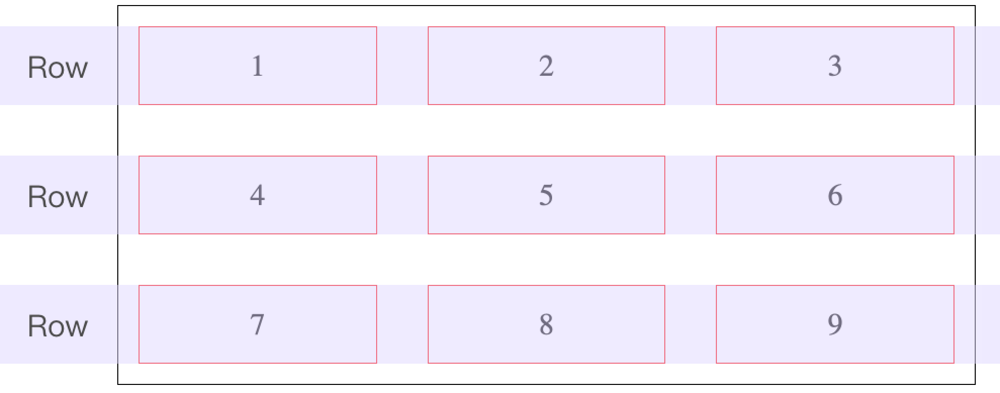
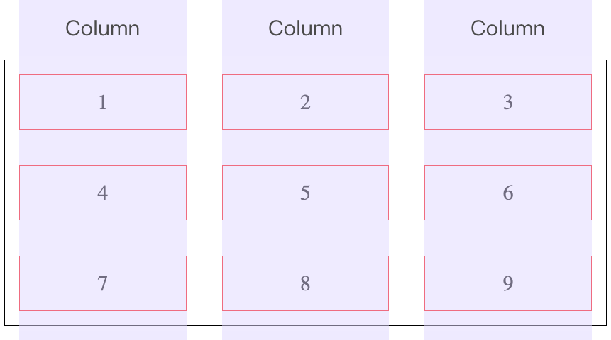
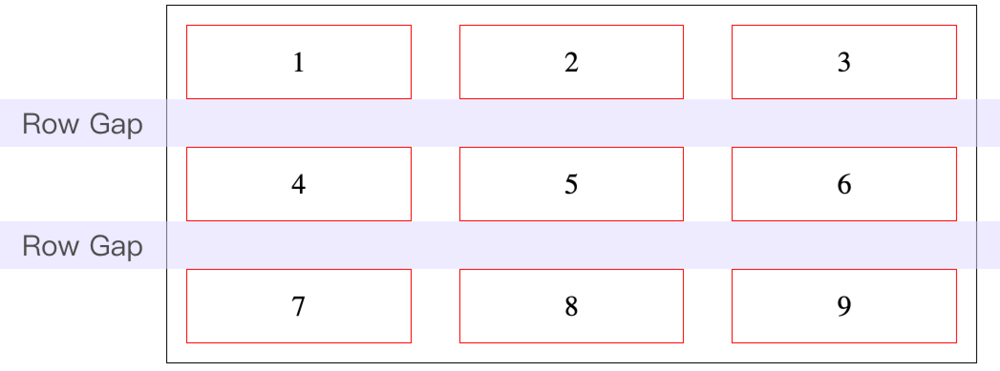
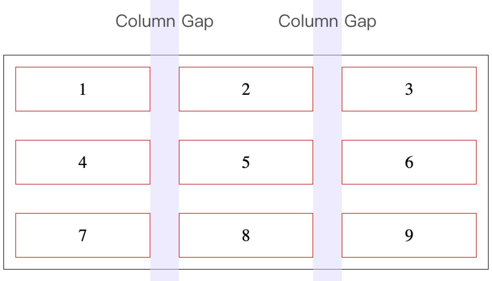
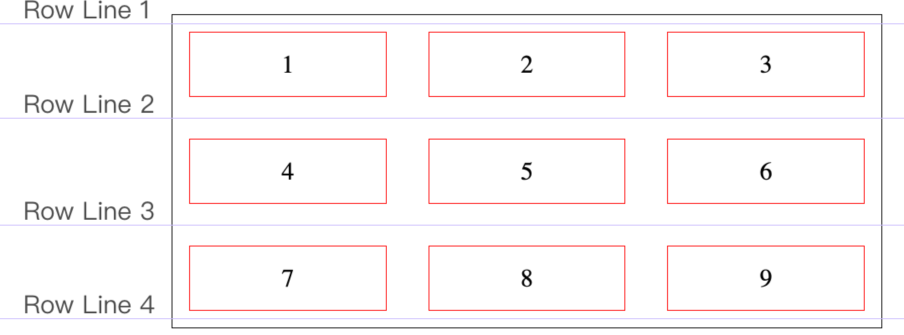
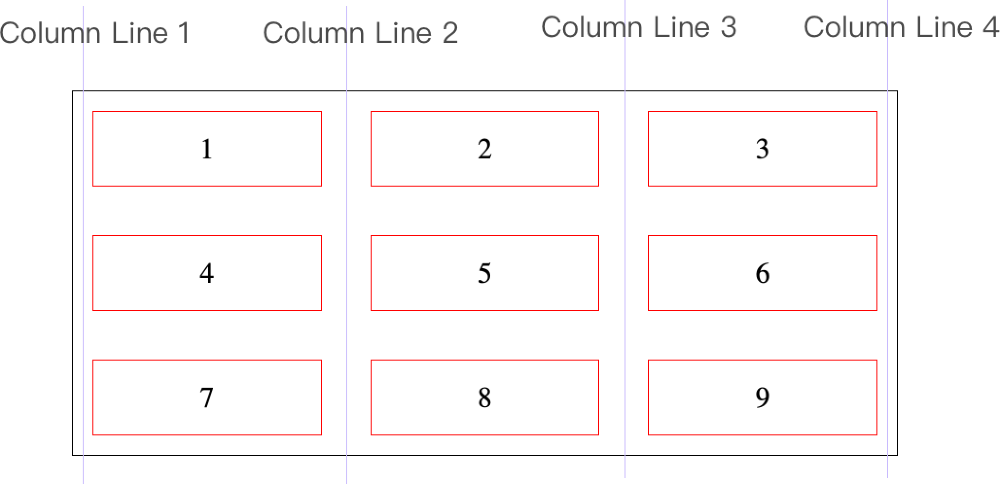
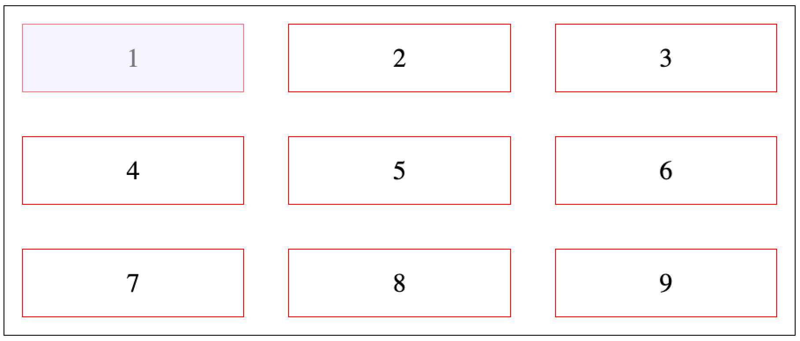
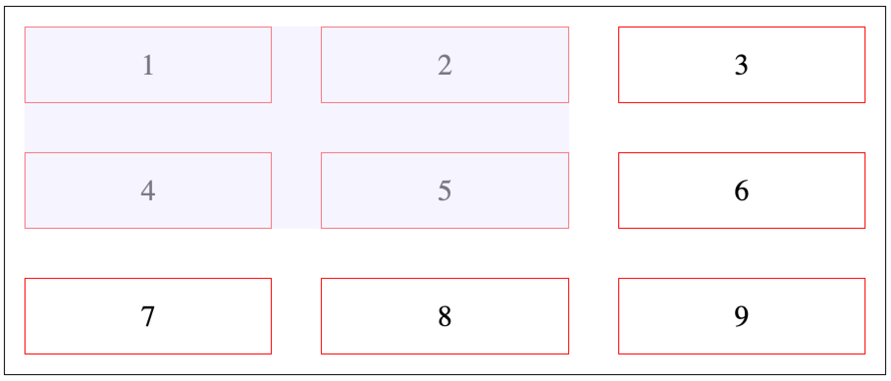

# 5.1 基本觀念及術語

## 認識 grid 和 inline-grid

`display` 屬性設定：

* `grid`：區塊類型的 Grid Layout。
* `inline-grid`：行內區塊類型的 Grid Layout。

例：




## 認識基本術語

以九宮格為例：




### Grid Container 和 Grid Items

* 有設定 display 為 `grid` 或 `inline-grid` 的元素，就叫做 **`Grid container`**。
* 在 **`Grid Container`** 裡面的第一層子元素，統稱叫做 **`Grid Items`**。


### Grid Tracks

Grid Row Track：

<figure><figcaption></figcaption></figure>


Grid Column Track：

<figure><figcaption></figcaption></figure>


### Grid Gaps

<figure><figcaption></figcaption></figure>


<figure><figcaption></figcaption></figure>


### Grid Lines

留意每條 Grid Line 都有自己的編號，如下所示；也可以反向的來數，反向的話，就是從 **`-1`** 開始數。


<figure><figcaption></figcaption></figure>


<figure><figcaption></figcaption></figure>


### Grid Cell

<figure><figcaption></figcaption></figure>


### Grid Area

<figure><figcaption></figcaption></figure>


### Grid Axis

* Row Axis：也稱做 Inline Axis。
* Column Axis：也稱做 Block Axis。


## 二欄式排版



```markup
<div class="grid_container">
  <div class="grid_item">左欄</div>
  <div class="grid_item">右欄</div>
</div>
```



```css
*{
  box-sizing: border-box;
}
div.grid_container{
  border: 1px solid red;
  width: 600px;
  margin: 0 auto;
  
  display: grid;
  grid-template-columns: 200px auto;
  grid-gap: 20px;
}
div.grid_item{
  border: 1px solid blue;
}
```



例：




## 三欄式排版



```markup
<div class="grid_container">
  <div class="grid_item">左欄</div>
  <div class="grid_item">中間欄</div>
  <div class="grid_item">右欄</div>
</div>
```



```css
*{
  box-sizing: border-box;
}
div.grid_container{
  border: 1px solid red;
  width: 800px;
  margin: 0 auto;
  
  display: grid;
  grid-template-columns: 200px auto 200px;
  grid-gap: 20px;
}
div.grid_item{
  border: 1px solid blue;
}
```



例：




