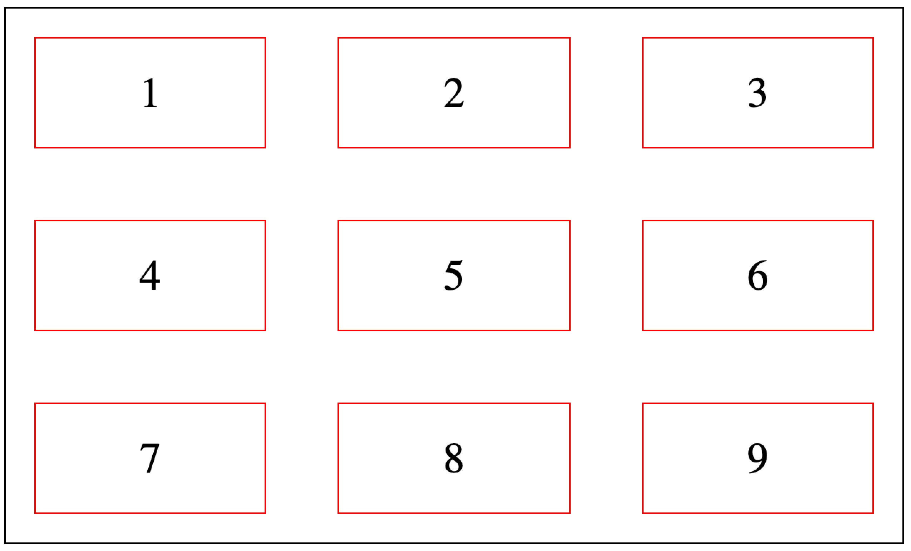
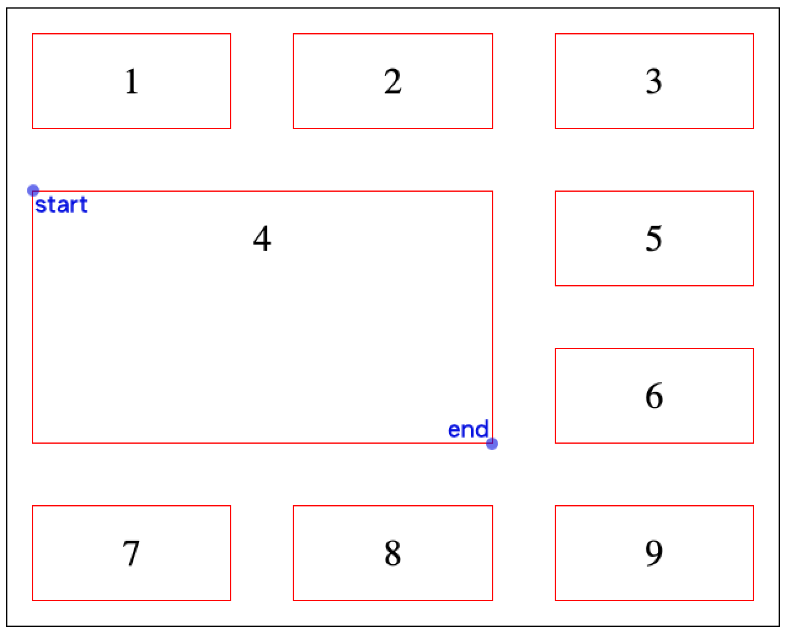

# 5.3 Grid Items

Grid Items 相關屬性。

## grid-column

* 數值指的是 Grid Column Line 的意思。
* span 2：指的是擴展兩個欄的意思。

```css
/* 寫法一 */
grid-column: 1 / 3;

/* 寫法二：使用 line 的命名 */
/*
使用 Grid Line 的名稱，假設在 Grid Container 有設定：
grid-template-columns: [a] auto [b] auto [c] auto [d];
*/
grid-column: a / c;

/* 寫法三 */
grid-column-start: 1;
grid-column-end: 3;

/* 寫法四 */
grid-column: 1 / span 2;
```


例：




## grid-row

* 數值指的是 Grid Row Line 的意思。
* span 2：指的是擴展兩個欄的意思。

```css
/* 寫法一 */
grid-row: 1 / 4;

/* 寫法二：使用 line 的命名 */
/*
使用 Grid Line 的名稱，假設在 Grid Container 有設定：
grid-template-rows: [a] auto [b] auto [c] auto [d];
*/
grid-row: a / d;

/* 寫法三 */
grid-row-start: 1;
grid-row-end: 4;

/* 寫法四 */
grid-row: 1 / span 3;
```


例：




## grid-area

原來九個欄位如下：

<figure><figcaption></figcaption></figure>

將 4 的那個欄位，擴展到 4、5、7、8，變成如下：

<figure><figcaption></figcaption></figure>


```css
/* 寫法一 */
grid-row-start: 2;
grid-column-start: 1;
  
grid-row-end: 4;
grid-column-end: 3;

/* 寫法二 */
grid-area: 2 / 1 / 4 / 3;

/* 寫法三 */
grid-area: 2 / 1 / span 2 / span  2;
```


例 1：使用 Grid Line 來設定範圍：




例 2：使用 grid-area 來將欄位指定位置(例：將 1 和 9 對調)：




例 3： **`grid-area`** 也可以用來設定這個 Item 的**名稱**，然後就可以在 `Grid Container` 中使用 **`grid-template-areas`** 中直接指定名稱。

```css
div.item{
  grid-area: header;
}
```


範例請參考 **`grid-template-areas`** 屬性。



## 排列相關


### justify-self

請參考 `justify-items`。


### align-self

請參考 `align-items`。


### place-self

請參考 `place-items`。

是 `justify-self` 和 `align-self` 的簡寫形式，格式如下：

```css
place-self: <align-self> <justify-self>;
```


