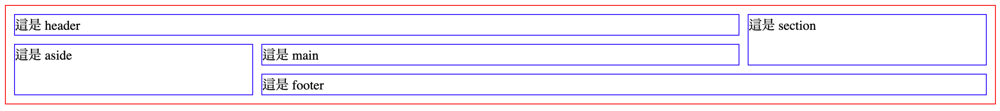

# 6.4 練習

## 練習 1：Grid 排版模式的 Bug

Grid 排版模式中，不允許斷行時，遇到的問題：當 Grid Items 中，裡面有元素設定了「不允許斷行(例：**`white-space: nowrap;`**)」，那麼 Grid Items 若沒有設定固定寬，那 Grid Items 的寬度就會被撐開。

解決方式：在 Grid Items 元素，設定 **`min-width: 0;`** 即可解決。

例：




## 練習 2

建立 `grid_practice.html` 來練習，請貼上以下原始碼：



```markup
<div class="grid_container">
  <header class="grid_item">
    這是 header
  </header>
  <aside class="grid_item">
    這是 aside
  </aside>
  <main class="grid_item">
    這是 main
  </main>
  <section class="grid_item">
    這是 section
  </section>
  <footer class="grid_item">
    這是 footer
  </footer>
</div>
```



```css
div.grid_container{
  border: 1px solid red;
  padding: 10px;
  display: grid;
  gap: 10px;
  grid-template-columns: 1fr 2fr 1fr;
}
div.grid_container .grid_item{
  border: 1px solid blue;
}
```




使用 Grid 排版模式，變成如下圖佈局：

<figure><figcaption></figcaption></figure>


### 方式一：使用 Grid Line 來切

例如 `header.grid_item`：

```css
div.grid_container header.grid_item{
  grid-column: 1 / 3;
}
```


參考作法：




### 方式二：使用命名方式

給定各個 Item 命名如下：

```css
div.grid_container header.grid_item{
  grid-area: header;
}
div.grid_container aside.grid_item{
  grid-area: aside;
}
div.grid_container main.grid_item{
  grid-area: main;
}
div.grid_container section.grid_item{
  grid-area: section;
}
div.grid_container footer.grid_item{
  grid-area: footer;
}
```

參考作法：



