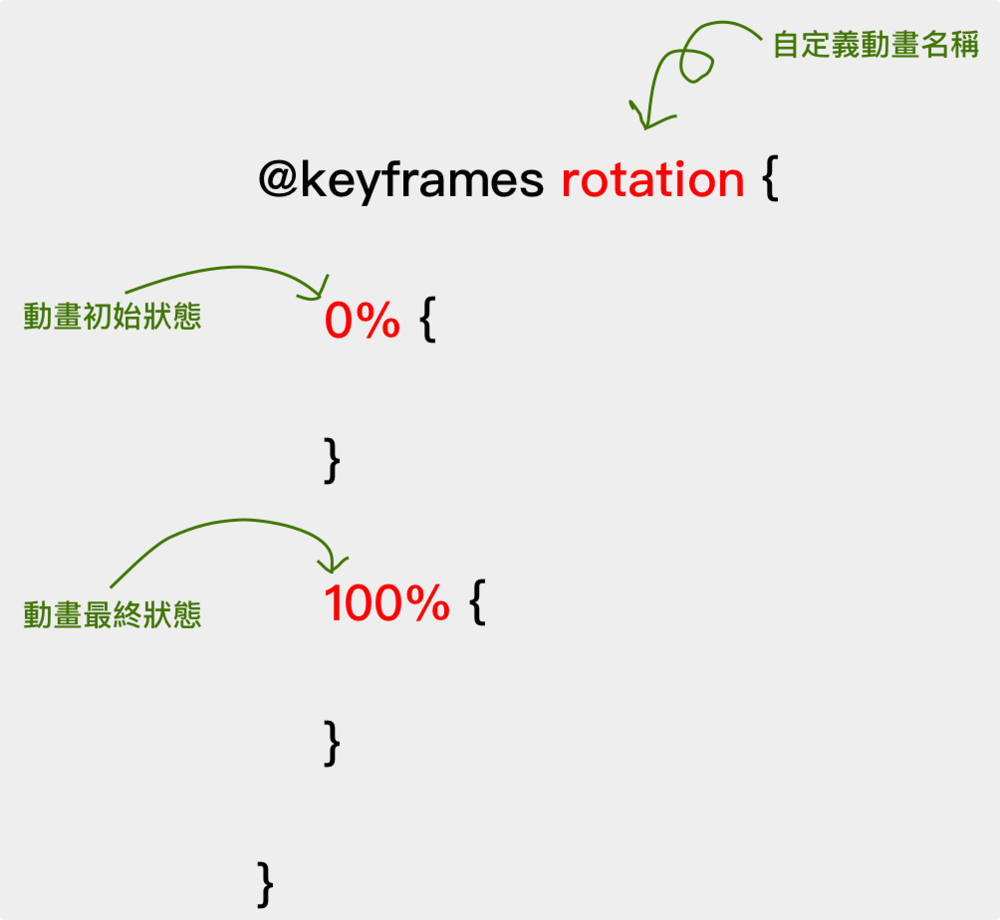

# 7.1 第一個 animation

## 相關 CSS

* @keyframes：用來建立一個動畫效果的名稱，然後創造動畫影格。
* animation-name：某個動畫效果的名稱。
* animation-duration：動畫效果要執行的「期間」。

先瞭解這三樣東西，就可以至少將動畫效果套用至指定元素。


## 第一個 animation 解說

1、動畫名稱、初始狀態、最終狀態，程式碼的撰寫方式，如下圖：

<figure><figcaption></figcaption></figure>

2、設定一個名稱叫做 **rotation** 的動畫，初始狀態(0%)時，設定 transform 為 rotate(0deg)；最終狀態(100%)時，設定 transform 為 rotate(360deg)，如下程式碼：

```css
@keyframes rotation {
  0% {
    transform: rotate(0deg);
  }
  100% {
    transform: rotate(360deg);
  }
}
```

3、讓某個元素套用由 **`@keyframes`** 做好的 **`rotation`** 動畫，並且設定執行期間為 5 秒：

```css
div.img_block{
  /*  套上動畫效果 */
  animation-name: rotation;
  animation-duration: 5s;
}
```


