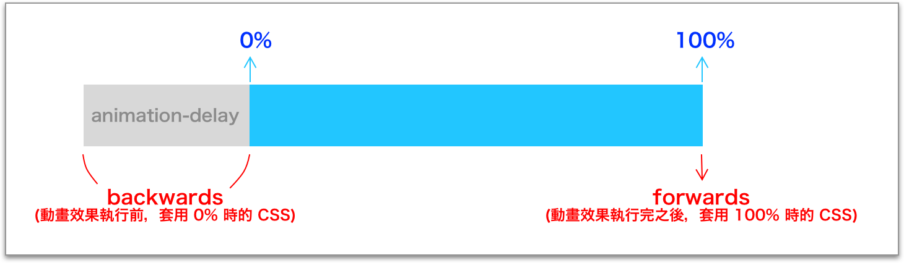

# 7.7 animation-fill-mode

## animation-fill-mode 設明

動畫效果的執行期間，指的是從 0% \~ 100%，而 `animation-fill-mode` 是用來設定，當動畫效果未執行的時候(也就是 0% 之前的延遲期間，以及 100% 之後)。可設定如下：

* **`none`**：預設值。
* **`forwards`**：動畫播放結束後，仍保留最後 keyframe(即 100%) 的 css。
* **`backwards`**：動畫在延遲期間( animation-delay )，要停留在第一個 keyframe(即 0%) 的 css。
* **`both`**：同時套用 forwards 及 backwards 的特性。

示意圖：

<figure><figcaption></figcaption></figure>

例：

