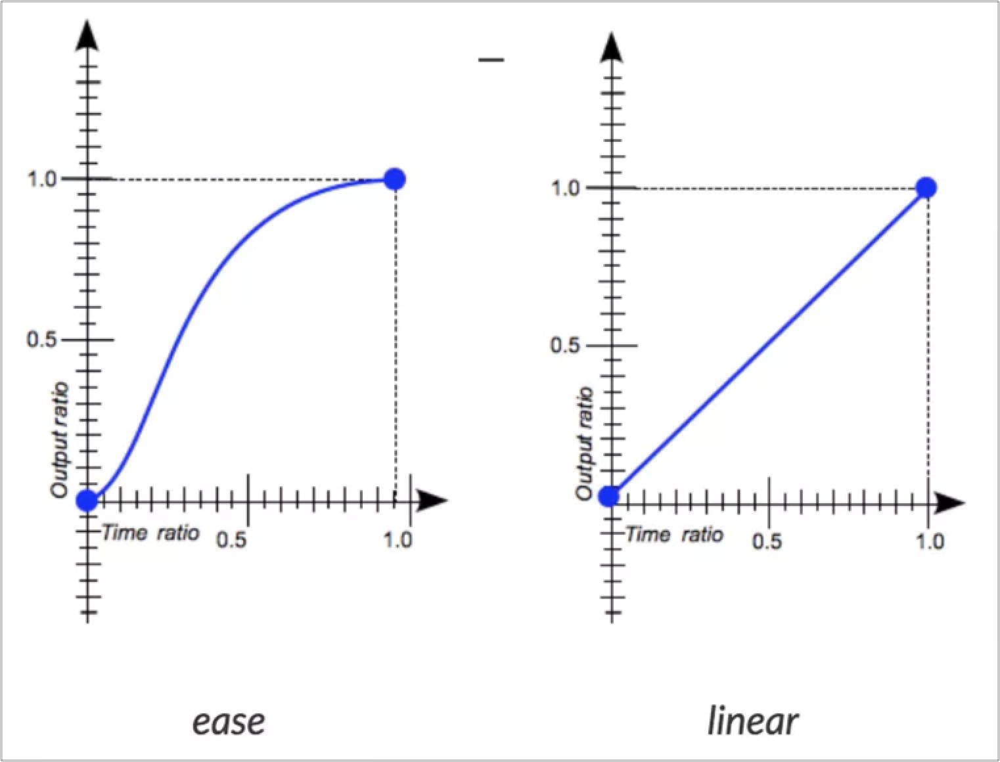
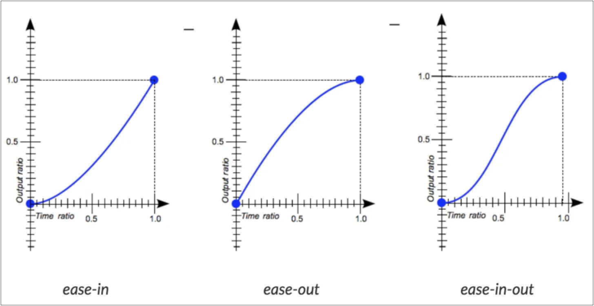
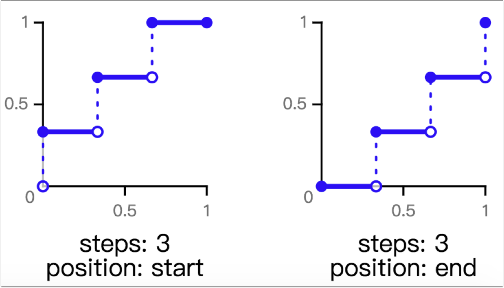

# 7.9 animation-timing-function

## animation-timing-function 說明

透過使用 `animation-timing-function` ，可以控制動畫效果的速度曲線，背後的原理是 cubic-bezier。

animation-timing-function 有七種模式：

* ease：這是預設。相當於 `cubic-bezier(.25, .1, .25, 1)`
* linear：相當於 `cubic-bezier(0, 0, 1, 1)`
* ease-in：相當於 `cubic-bezier(.42, 0, 1, 1)`
* ease-out：相當於 `cubic-bezier(0, 0, .58, 1)`
* ease-in-out：相當於 `cubic-bezier(.42, 0, .58, 1)`
* cubic-bezier(n, n, n, n)
* steps(int, start | end)


## 1 ease、linear

* **`ease`**：低速 → 加快 → 減速至結束。這是預設值。
* **`linear`**：速度保持一致。

示意圖：

<figure><figcaption></figcaption></figure>

例：(一個元素從左邊跑到右邊)




## 2 ease-in、ease-out、ease-in-out

* **`ease-in`**：以低速開始。
* **`ease-out`**：以低速結束。
* **`ease-in-out`**：以低速開始，也以低速結束。

示意圖：

<figure><figcaption></figcaption></figure>

例：




## 3 cubic-bezier(x1, y1, x2, y2) 函式

像上述的 ease(預設)、linear、ease-in、ease-out、ease-in-out 等，都是別名，其實背後都是透過 **`cubic-bezier()`** 函式來達成。

這裡有兩個不錯的網站：

* [自訂曲線](http://cubic-bezier.com/#.17,.67,.83,.67)：自行建立曲線，來創造動畫不同的執行速度。
* [Easing Functions](https://easings.net/en)：列出很多已經建好的函式形式，可以直接套用。

例如 `linear`，我們其實也可以用以下來代替(相當於 `cubic-bezier(0, 0, 1, 1)`)：

```css
animation-timing-function: cubic-bezier(0, 0, 1, 1);
```

所以透過 **`cubic-bezier()`** 函式 ，可以自訂任何想要的動畫執行速度快慢。


## 4 steps(int, start | end) 函式

這會以跳躍式的方式來執行，第一個參數(steps)是一個正整數，表示有幾個間隔；而第二個參數(position)可設定 start 或 end(若沒有提供的話，預設是 `end` )，來看看範例來瞭解其中差異：

想成如果是 start，就是一開始就要跳。

示意圖：

<figure><figcaption></figcaption></figure>

例：




## 練習：Sprite 動畫效果


