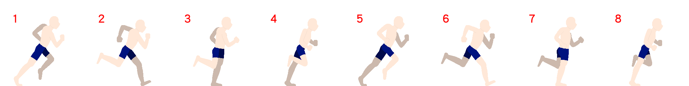
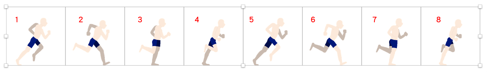
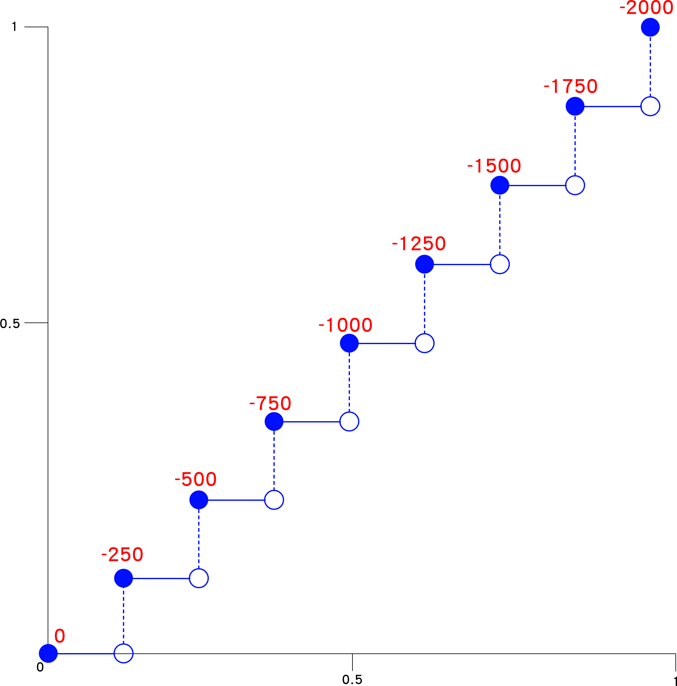

# 8.11 練習

## 練習 1：Sprite 動畫效果

建立 `practice/animation_sprite.html` 檔案，試試看以下效果：

一張圖，寬 2000px，高 250px，如下：

<figure><figcaption></figcaption></figure>

圖片路徑：[https://alldata.sgp1.digitaloceanspaces.com/images/sprite.png](https://alldata.sgp1.digitaloceanspaces.com/images/sprite.png)


以下做個劃分，也就是上面這張圖，其實是 8 張圖片，合成一張，如下示意：

<figure><figcaption></figcaption></figure>

使用 `animation-timing-function` 中的 **`steps`** 完成 Sprite 動畫效果。

提供 HTML 如下：

```html
<div class="sprite_block1">
  
</div>
```


提示的示意圖：

<div data-full-width="false">

<figure><figcaption></figcaption></figure>

</div>


參考作法：




## 練習 2：Loading Icon

直接參考以下 codepen：



