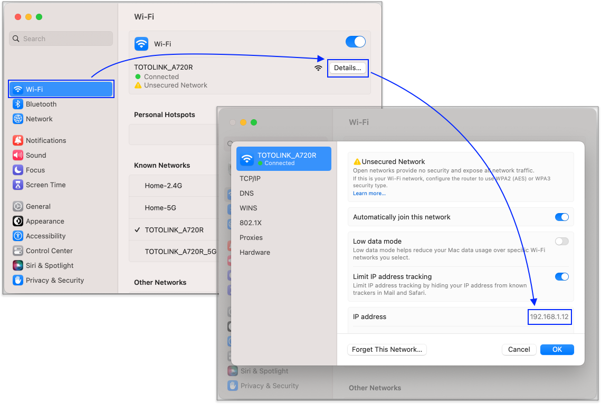

# 8 手機連本機端網站

## 使用相同區網方式

在本機端開發的時候，我們常常會使用 `http://localhost` 這樣的網址來開發，但問題在實做 RWD 的時候，有時會希望在手機上能實際瀏覽，那就讓手機及電腦連到**相同區網**即可，那我們就可以在手機上的瀏覽器輸入網址來連線。


進行以下步驟之前，需先確認自己本機端有網站正在執行。例如：**`http://127.0.0.1:5500`**


## 找到自己電腦的 IP

如下示意：

### Mac

<figure><figcaption></figcaption></figure>

註：如果 Mac 想透過像以下的 Windows 那樣輸入指令的話，就在終端機中，輸入 **`ifconfig`** 尋找。(不是 ~~**`ipconfig`**~~。)

### Windows

開啟「命令提示字元」：

